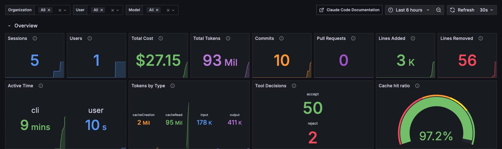
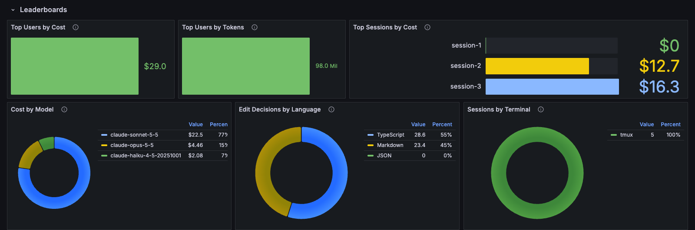
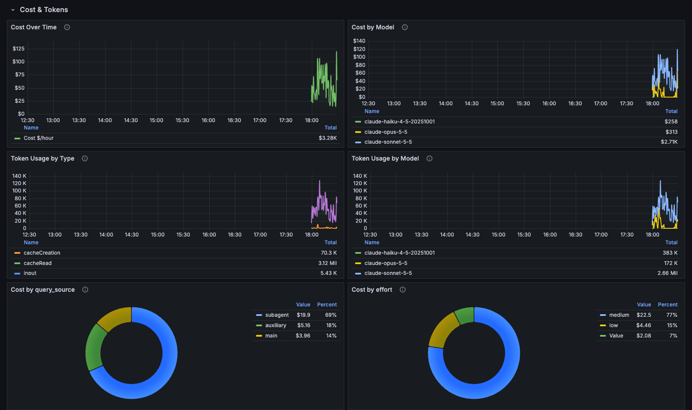
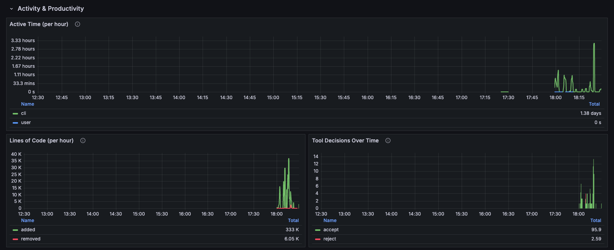
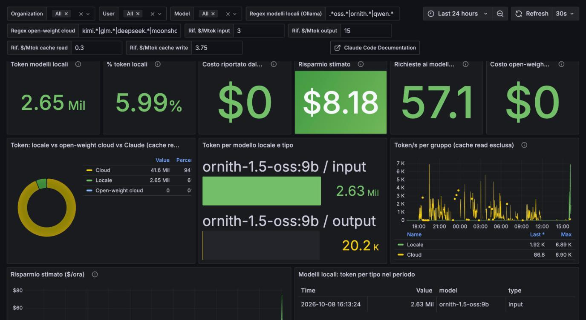
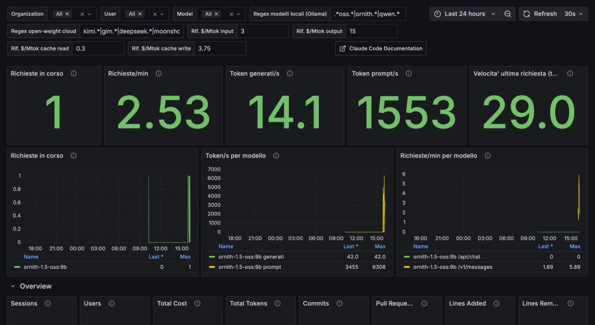

# GC Claude Code OTel Dashboard

Stack Docker pronto all'uso per capire **dove vanno i token di Claude Code**: costo e token per modello, sessione, tipo (input / output / cache read / cache write), cache hit ratio, subagent vs sessione principale, attivita' e produttivita'.

```
Claude Code --OTLP gRPC :4317--> OpenTelemetry Collector --:8889--> Prometheus :9090 --> Grafana :3000
```

Tutto gira in locale. Nessun dato lascia la tua macchina.

## Screenshot

### 1. Overview

Colpo d'occhio sul periodo selezionato: sessioni, costo e token totali, commit, righe di codice, tempo attivo. **Tokens by Type** mostra la proporzione tra input, output, cache read e cache creation. **Cache hit ratio** indica quanto contesto viene riletto dalla cache invece di essere rielaborato. In alto i filtri Organization, User e Model valgono per tutta la dashboard.



### 2. Leaderboard

Chi e cosa consuma di piu': utenti e sessioni per costo e token, costo per modello, decisioni sugli edit per linguaggio, sessioni per terminale. Serve a individuare le sessioni "pesanti" e a vedere quanto pesa un modello costoso come Opus rispetto a Sonnet o Haiku.



### 3. Costi e token

L'andamento nel tempo (rate in dollari/ora e token/s) per modello e per tipo di token. In fondo i due pannelli piu' utili per capire gli sprechi: **Cost by query_source** separa `main`, `subagent` e `auxiliary`, **Cost by effort** separa i livelli di effort del modello.



### 4. Attivita' e produttivita'

Tempo attivo, righe di codice aggiunte e rimosse, decisioni accept / reject sui tool. Utile per mettere in relazione il consumo con il lavoro prodotto.



## Cosa c'e' dentro

| Servizio | Immagine | Ruolo |
|---|---|---|
| `otel-collector` | `otel/opentelemetry-collector-contrib` | Riceve OTLP da Claude Code, converte i contatori delta in cumulativi, li espone a Prometheus |
| `prometheus` | `prometheus/Dockerfile` (base `prom/prometheus`) | Scrape ogni 15 s, retention 90 giorni |
| `grafana` | `grafana/Dockerfile` (base `grafana/grafana`) | Datasource e dashboard gia' provisioned |

La dashboard e' [Claude Code Metrics (Prometheus)](https://grafana.com/grafana/dashboards/25255) di rockdarko ([repo](https://github.com/rockdarko/claude-code-metrics-prometheus), licenza MIT), con il datasource fissato all'istanza locale.

## Requisiti

- Docker con Docker Compose v2
- Claude Code con accesso a `~/.claude/settings.json`

## Installazione

1. Avvia lo stack:

   ```bash
   git clone https://github.com/giorgiocerruti/gc-claude-code-otel-dashboard.git
   cd gc-claude-code-otel-dashboard
   docker compose up -d --build
   ```

2. Abilita la telemetria in Claude Code. Aggiungi queste variabili al blocco `env` di `~/.claude/settings.json` (vedi `settings.example.json`):

   ```json
   {
     "env": {
       "CLAUDE_CODE_ENABLE_TELEMETRY": "1",
       "OTEL_METRICS_EXPORTER": "otlp",
       "OTEL_EXPORTER_OTLP_PROTOCOL": "grpc",
       "OTEL_EXPORTER_OTLP_ENDPOINT": "http://localhost:4317",
       "OTEL_METRIC_EXPORT_INTERVAL": "15000"
     }
   }
   ```

3. **Riavvia Claude Code.** Le sessioni aperte non rileggono le variabili.

4. Apri http://localhost:3000. La dashboard e' la home.

I primi dati compaiono 1-2 minuti dopo la prima risposta del modello in una sessione avviata dopo il passo 3.

## Quota rimasta e consumo per progetto

Le metriche OTel di Claude Code non contengono ne' la quota rimasta ne' il progetto. Si aggiungono con due piccoli script in `scripts/`.

### Quota 5h e settimanale

La statusline di Claude Code riceve dal client `rate_limits.five_hour` e `rate_limits.seven_day` (percentuale usata e orario di reset, solo su abbonamenti Pro/Max, dopo la prima risposta del modello). `scripts/push-quota.sh` legge quel JSON e invia al collector due gauge:

| Metrica | Label |
|---|---|
| `claude_quota_used_percent` | `window` = `5h` o `7d` |
| `claude_quota_resets_at_timestamp_seconds` | `window` = `5h` o `7d` |

Non esiste un limite giornaliero: la **sessione** e' la finestra di 5 ore, il limite **settimanale** e' quella di 7 giorni.

Installazione (servono `jq` e `curl`):

```bash
mkdir -p ~/.claude/otel
cp scripts/push-quota.sh scripts/claude-otel-project.zsh ~/.claude/otel/
chmod +x ~/.claude/otel/push-quota.sh
```

Nello script della statusline (`~/.claude/settings.json` -> `statusLine.command`), subito dopo la lettura dell'input (`input=$(cat)`), aggiungi:

```bash
echo "$input" | "$HOME/.claude/otel/push-quota.sh" >/dev/null 2>&1 &
```

Se non hai una statusline personalizzata, ne basta una che esegue solo quella riga e stampa qualcosa. L'invio e' limitato a uno ogni 20 secondi (`OTEL_QUOTA_MIN_INTERVAL`). L'endpoint di default e' `http://localhost:4318/v1/metrics` (`OTEL_QUOTA_ENDPOINT`).

### Nome del progetto

Claude Code non dice in quale progetto sta lavorando una sessione. `scripts/claude-otel-project.zsh` definisce una funzione `claude` che imposta `OTEL_RESOURCE_ATTRIBUTES=project.name=<nome>` prima di avviarlo. Il nome e' quello del repository git (anche dai worktree, che puntano al repository principale), altrimenti quello della cartella. In Prometheus diventa la label `project_name`.

Aggiungi a `~/.zshrc`:

```bash
source "$HOME/.claude/otel/claude-otel-project.zsh"
```

Vale solo per le sessioni avviate da quella shell dopo l'installazione. Le altre compaiono come `(non assegnato)`. L'agente principale senza `agent_name` compare come `(sessione principale)`.

La stessa funzione imposta anche `OTEL_LOG_TOOL_DETAILS=1`. Senza, Claude Code sostituisce i nomi degli agenti custom con `custom` (e quelli di skill, plugin e server MCP di terze parti con `custom` / `third-party`), quindi non si capisce quale agente consuma di piu'. Gli agenti built-in (`Explore`, `general-purpose`) compaiono sempre in chiaro. Serve Claude Code >= 2.1.273; lo storico gia' raccolto resta `custom`, i nomi reali valgono dalle nuove sessioni. Se non usi il wrapper, imposta `OTEL_LOG_TOOL_DETAILS=1` in `~/.claude/settings.json` sotto `env`. Attenzione: la variabile abilita anche il log dei parametri dei tool negli eventi, non solo i nomi nelle metriche.

### Cosa mostrano i nuovi pannelli

- **Quota**: percentuale usata e rimasta per 5h e 7d, tempo al reset, andamento, velocita' di consumo in %/ora e **previsione della quota settimanale al reset** (sopra 100% finisci il budget prima del reset).
- **Chi consuma**: costo per progetto, agente e modello nel periodo selezionato, costo e token per progetto nel tempo, tabella progetto x agente x modello.
- **Stima % quota 7d** per progetto, agente e modello: la quota settimanale usata ripartita in proporzione al costo degli ultimi 7 giorni. E' una **stima**: il costo calcolato dal client approssima il peso reale sul limite, e la finestra di 7 giorni scorrevole non coincide esattamente con quella del reset.

## Modelli locali (Ollama) e offload

Se Claude Code usa un modello non Anthropic tramite `ANTHROPIC_BASE_URL`, le sue metriche OTel arrivano con la label `model` di quel modello. La dashboard distingue tre gruppi con due variabili in alto (regex sulla label `model`, modificabili):

| Gruppo | Variabile | Default |
|---|---|---|
| Locale (Ollama) | `local_models` | `.*oss.*\|ornith.*\|qwen.*` |
| Open-weight cloud (a pagamento) | `openweight_models` | `kimi.*\|glm.*\|deepseek.*\|moonshot.*` |
| Claude | | `claude-.*` |

La sezione **Modelli locali (Ollama) vs cloud** mostra:

- token locali, percentuale sul totale (cache read esclusa), token/s per gruppo. I numeri **locali** vengono dal proxy (`ollama_prompt_tokens_total`, `ollama_completion_tokens_total`, `ollama_requests_total`, filtrati con `local_models`), non dalle metriche OTel di Claude Code: il traffico deve passare dal proxy (`ANTHROPIC_BASE_URL=http://localhost:11435`). Il proxy non distingue i tipi di cache: i tipi sono solo `input` e `output`. I numeri Claude e open-weight restano da OTel;
- **risparmio stimato**: i token locali valorizzati ai prezzi di riferimento Anthropic. I prezzi sono le variabili `Rif. $/Mtok ...` (default 3 / 15 / 0.3 / 3.75): impostali sul modello Claude che il locale sostituisce. E' una stima, non conta energia e hardware;
- il costo che Claude Code riporta per locale e open-weight cloud. Per modelli sconosciuti al client e' 0 o un prezzo di ripiego: per i modelli a pagamento confrontalo con la fattura del provider.



La sezione **Ollama: stato del server** viene da `ollama-exporter/`, un piccolo exporter Python che legge `/api/ps` e `/api/tags` di Ollama sull'host (`host.docker.internal:11434`): modelli caricati, memoria, contesto, scadenza. Ollama non ha un endpoint `/metrics` ne' espone token o richieste.

La sezione **Ollama: attivita' (proxy)** viene da `ollama-proxy`, un proxy Go di terzi ([elliotfehr/ollama-metrics-proxy](https://github.com/elliotfehr/ollama-metrics-proxy), MIT, compilato dal commit pinnato in `docker-compose.yml`). Ascolta su `127.0.0.1:11435` e inoltra a Ollama sull'host: conta richieste, richieste in corso e token (endpoint `/api/*`, `/v1/chat/completions`, `/v1/messages`). Vede **solo il traffico che lo attraversa**: punta i client sul proxy, per Claude Code `ANTHROPIC_BASE_URL=http://localhost:11435`. Token/s per richiesta e tempi di valutazione arrivano solo dagli endpoint nativi `/api/*`.



### Sessioni in container (claude-infrastructure-template)

La skill `oss-offload` lancia ogni agente instradato in un container `docker run --rm` (immagine `claude-oss`) e non passa variabili `OTEL_*`. Senza telemetria quei token non arrivano al collector. Aggiungi in `.claude/oss-offload.json` del progetto (`env` viene passato al worker):

```json
"env": {
  "CLAUDE_CODE_ENABLE_TELEMETRY": "1",
  "OTEL_METRICS_EXPORTER": "otlp",
  "OTEL_EXPORTER_OTLP_PROTOCOL": "grpc",
  "OTEL_EXPORTER_OTLP_ENDPOINT": "http://host.docker.internal:4317",
  "OTEL_METRIC_EXPORT_INTERVAL": "5000",
  "OTEL_RESOURCE_ATTRIBUTES": "project.name=<progetto>"
}
```

Il container vive poco: l'intervallo breve riduce il rischio di perdere l'ultimo batch. `host.docker.internal` e' gia' risolto dallo script con `--add-host`.

## Porte

Tutte le porte sono legate a `127.0.0.1`.

| Porta | Servizio |
|---|---|
| 3000 | Grafana |
| 9090 | Prometheus |
| 4317 / 4318 | OTLP gRPC / HTTP |

## Verifica

```bash
curl -s localhost:9090/api/v1/label/__name__/values | tr ',' '\n' | grep claude_code
```

Devono comparire, tra le altre, `claude_code_token_usage_tokens_total` e `claude_code_cost_usage_USD_total`.

## Metriche principali

| Metrica | Label utili |
|---|---|
| `claude_code_token_usage_tokens_total` | `type`, `model`, `session_id`, `query_source`, `agent_name`, `mcp_server_name`, `effort`, `project_name` |
| `claude_code_cost_usage_USD_total` | `model`, `session_id`, `query_source`, `agent_name`, `mcp_server_name`, `effort`, `project_name` |
| `claude_code_session_count_total` | |
| `claude_code_active_time_seconds_total` | |
| `claude_code_lines_of_code_count_total`, `claude_code_commit_count_total`, `claude_code_pull_request_count_total`, `claude_code_code_edit_tool_decision_total` | |
| `ollama_requests_total`, `ollama_prompt_tokens_total`, `ollama_completion_tokens_total` (job `ollama-proxy`) | `model`, `endpoint` |
| `ollama_active_requests`, `ollama_tokens_per_second` (job `ollama-proxy`) | `model`, `endpoint` |

Il costo e' una stima calcolata dal client, vicina ma non identica alla fatturazione. Con i piani a limite settimanale conta il consumo, non i dollari: usalo come confronto relativo tra modelli, sessioni e subagent.

Il pannello **Cost by query_source** separa sessione principale (`main`), `subagent` e `auxiliary`: e' il modo piu' rapido per vedere se sono i subagent a consumare il limite.

## Query utili

Token "pesanti" (senza cache read) per modello, ultimi 7 giorni:

```
sum by (model) (increase(claude_code_token_usage_tokens_total{type!="cacheRead"}[7d]))
```

Sessioni piu' costose, ultimi 7 giorni:

```
topk(10, sum by (session_id) (increase(claude_code_cost_usage_USD_total[7d])))
```

Costo per agente (`agent_name`), ultimi 7 giorni:

```
topk(10, sum by (agent_name) (increase(claude_code_cost_usage_USD_total[7d])))
```

Quota di costo dei subagent:

```
sum(increase(claude_code_cost_usage_USD_total{query_source="subagent"}[7d])) / sum(increase(claude_code_cost_usage_USD_total[7d]))
```

## Note e limiti

- **Storico.** I dati partono dal momento dell'attivazione. OTel non recupera il passato.
- **Grafici temporali.** I pannelli "Over Time" e "Usage by ..." mostrano un rate (dollari/ora, token/s). La colonna `Total` nella legenda somma i campioni del rate e non e' un totale reale: per il totale usa gli stat in alto (`Total Cost`, `Total Tokens`).
- **`deltatocumulative`.** Claude Code esporta contatori delta. L'exporter Prometheus non li accetta, quindi senza il processor in `otel-collector/otel-collector.yml` le metriche token e costo non compaiono (sessioni e tempo attivo si').
- **Accesso Grafana.** E' anonimo come Admin, pensato solo per uso locale. Non esporre la porta 3000 su una rete.
- **Privacy.** Le metriche includono `user_email`, `organization_id` e `session_id`. Non pubblicare screenshot senza aver controllato i pannelli dei leaderboard.

## Gestione

```bash
docker compose ps            # stato
docker compose logs -f otel-collector
docker compose down          # stop, i dati restano nei volumi
docker compose down -v       # stop e cancella tutti i dati
```

## Troubleshooting

- Nessuna metrica `claude_code_*`: controlla `docker compose ps` e i log del collector (logga ogni batch ricevuto).
- Pannelli vuoti: controlla l'intervallo di tempo e i filtri Organization / User / Model.
- Porta occupata: cambia la porta host in `docker-compose.yml`.
- Dopo aver modificato la dashboard o la config: `docker compose up -d --build`.

## Licenza

MIT. La dashboard originale e' di rockdarko, anch'essa MIT.
